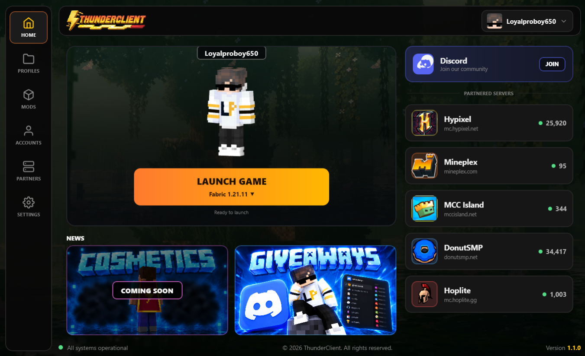
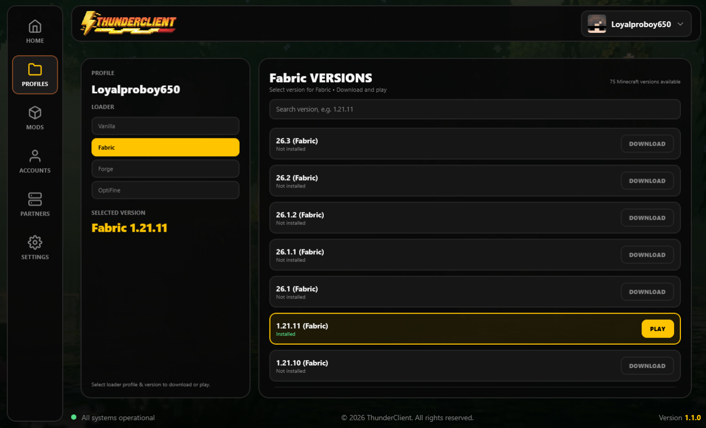
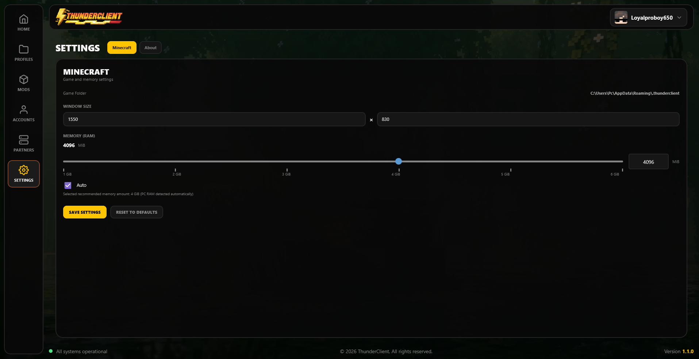

<div align="center">


### The Next Generation Minecraft Launcher

<p>
A modern, lightweight and powerful Minecraft launcher<br>
built with Kotlin + JetBrains Compose Desktop.
</p>

<br>

<a href="https://github.com/L0yalPr0b0y/ThunderClient/releases/latest">

</a>

<a href="https://github.com/L0yalPr0b0y/ThunderClient/releases">

</a>

<a href="https://github.com/L0yalPr0b0y/ThunderClient">

</a>

<br><br>


</div>

---

# ⚡ About

**Thunder Client** is a modern Minecraft launcher designed around one simple idea:

> **Launch faster. Manage easier. Play better.**

Built from the ground up with **Kotlin** and **JetBrains Compose Desktop**, Thunder Client provides a clean and modern interface for managing Minecraft installations, profiles, accounts and game files.

---

# ✨ Highlights

<table>
<tr>
<td width="50%">

## 🎮 Minecraft

* Multiple Minecraft versions
* Vanilla profiles
* Fabric profiles
* Forge profiles
* OptiFine profiles
* Automatic assets
* Automatic libraries
* Native libraries

</td>

<td width="50%">

## ⚡ Launcher

* Modern dark UI
* Lightweight design
* Custom window size
* Persistent settings
* Automatic RAM detection
* Manual RAM allocation
* Java 21 detection
* Background downloads

</td>
</tr>

<tr>
<td>

## 👤 Accounts

* Offline accounts
* Multiple profiles
* Account switching
* Minecraft-style usernames
* Offline UUID support

</td>

<td>

## 🧩 Management

* Version management
* Game-file management
* Download management
* Logs
* Mods directory
* Dedicated launcher directory

</td>
</tr>
</table>

---

# 🖥️ Screenshots

<div align="center">

### 🏠 Home



<br><br>

### 📦 Versions



<br><br>

### ⚙️ Settings



</div>

---

# 🧱 Architecture

```text
Thunder Client
│
├── Launcher UI
│   ├── Home
│   ├── Versions
│   ├── Mods
│   └── Settings
│
├── Account System
│   └── Offline Profiles
│
├── Minecraft Manager
│   ├── Versions
│   ├── Libraries
│   ├── Assets
│   └── Natives
│
└── Game Launcher
    ├── Java Detection
    ├── Classpath
    └── Minecraft Process
```

---

# 🎨 Design System

Thunder Client uses a dark interface with a signature thunder-yellow accent.

| Element          | Hex       |
| ---------------- | --------- |
| ⚡ Thunder Yellow | `#FFC400` |
| 🖤 Background    | `#070707` |
| 🖤 Sidebar       | `#0B0B0B` |
| ◼ Card           | `#101010` |
| ◼ Card Light     | `#161616` |
| ⚪ White          | `#F5F5F5` |
| 🔘 Gray          | `#858585` |
| 🔲 Border        | `#252525` |
| 🔴 Error         | `#FF5555` |

---

# 🛠️ Technology

<div align="center">


</div>

| Technology              | Purpose                   |
| ----------------------- | ------------------------- |
| Kotlin                  | Main programming language |
| Compose Desktop         | UI framework              |
| Java 21                 | Runtime                   |
| Gradle                  | Build system              |
| Coroutines              | Background operations     |
| Mojang Version Manifest | Minecraft metadata        |

---

# 📦 Installation

## Requirements

* Windows 10 / Windows 11
* Java 21
* Internet connection

## Run From Source

```bash
git clone https://github.com/L0yalPr0b0y/ThunderClient.git
```

```bash
cd ThunderClient
```


---

# 📂 Data Directory

Thunder Client keeps its managed Minecraft data separate from the normal Minecraft directory.

```text
%APPDATA%\.thunderclient
```

```text
.thunderclient/
│
├── versions/
├── libraries/
├── assets/
├── natives/
├── mods/
└── logs/
```

---

# 🚀 Roadmap

### Launcher

* [x] Modern launcher UI
* [x] Dark theme
* [x] Version management
* [x] Offline accounts
* [x] Java detection
* [x] Asset downloading
* [x] Library downloading
* [x] RAM settings
* [x] Window settings

### Profiles

* [x] Vanilla
* [ ] Fabric improvements
* [ ] Forge improvements
* [ ] OptiFine improvements
* [ ] Advanced profile manager

### Future

* [ ] 🧩 Mod Manager
* [ ] 🎨 Resource Pack Manager
* [ ] ✨ Shader Manager
* [ ] 👕 Skin Manager
* [ ] 🌐 Server Manager
* [ ] 🔄 Automatic Updater
* [ ] 📥 Advanced Download Manager
* [ ] 🎮 More Minecraft Versions

---

# 📊 Project Stats

<div align="center">


</div>

---

# 🤝 Contributing

Want to help improve Thunder Client?

1. Fork the repository.
2. Create a feature branch.
3. Make your changes.
4. Commit your changes.
5. Push your branch.
6. Open a Pull Request.

```bash
git checkout -b feature/my-feature
git add .
git commit -m "Add new feature"
git push origin feature/my-feature
```

---

# 🐛 Bug Reports

Found a bug?

Open an issue and provide:

* Windows version
* Java version
* Minecraft version
* Thunder Client version
* Steps to reproduce
* Error message
* Crash log
* Screenshot

---

# 👨‍💻 Developer

<div align="center">


## ⚡ Loyalproboy650

**Creator & Developer of Thunder Client**

<a href="https://github.com/L0yalPr0b0y">

</a>

</div>

---

# ⭐ Support

If you like **Thunder Client**, consider giving the repository a ⭐.

Every star helps the project grow.

<div align="center">

### ⚡ BUILD. LAUNCH. PLAY.

# THUNDER CLIENT

**A lightweight Minecraft launcher by Loyalproboy650.**

<br>


</div>
